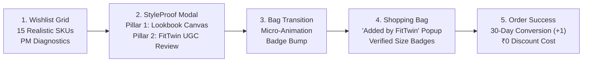

# 👗 MyntraStyleProof: Intent-Gated FitTwin & End-to-End Conversion Funnel
### Product Prototype for Increasing 30-Day Wishlist-to-Purchase Conversion Without Discounts

**MyntraStyleProof** is a high-fidelity interactive mobile web prototype built for the NextLeap Product Management Graduation Project. It directly addresses the two largest non-monetary conversion blockers identified in customer research: **Fit/Drape Sizing Anxiety (34.2%)** and **Wardrobe Pairing Uncertainty (28.4%)**.

---

## 🎯 Core Product Features



---

## 1. 15-Item Diverse Catalog Dataset
* **Topwear:** Suede Biker Jacket, Camp Collar Linen Shirt, Graphic Oversized Tee, Textured Knit Polo, Washed Denim Overshirt.
* **Bottomwear:** Slim Fit Cargo Trousers, Dark Indigo Tapered Jeans, Tailored Pleated Smart Chinos.
* **Footwear:** Chunky Street Leather Sneakers, Classic Tan Chelsea Boots, Camel Suede Skate Low-Tops.
* **Commodity / Excluded Categories (Gate Test Controls):** MicroModal Boxer Briefs, Cotton Ankle Socks, Polarized Sunglasses, Reversible Leather Belt.

---

## 2. Strict Intent & Category Eligibility Gating (`engine/eligibility_gate.py`)

FitTwin badges and styling recommendations are **strictly gated** to prevent cognitive overload and maintain brand trust:

```
                      ┌────────────────────────────────────────┐
                      │ User Browses Wishlist Item            │
                      └──────────────────┬─────────────────────┘
                                         ▼
                             [1. Category Gate]
                             Is SKU apparel/footwear?
                                 /            \
                              YES              NO ──► [CATEGORY_EXCLUDED] (Silent)
                              /
                             ▼
                             [2. Intent Gate]
                    Session Dwell ≥ 10s OR Repeat Views ≥ 2?
                                 /            \
                              YES              NO ──► [SILENT_NO_INTENT] (Standard Card)
                              /
                             ▼
                          [3. Confidence Gate]
                         Model Score ≥ 0.80?
                                 /            \
                              YES              NO ──► [SILENT_LOW_CONFIDENCE]
                              /
                             ▼
                    ┌──────────────────────────────────┐
                    │ System Action:                   │
                    │ • Returning: FULL_FITTWIN        │
                    │ • Cold-Start: FALLBACK_STAPLES   │
                    └──────────────────────────────────┘
```

---

## 3. 3-Persona Evaluation Harness

| Persona ID | Persona Profile | Owned Purchases | Intent State | System Action & Behavior |
| :--- | :--- | :--- | :--- | :--- |
| **`USER_ARJUN_01`** | **Arjun Sharma** (`5'9" • 68kg`, Zara M / Levi's 32) | **3 Orders** (Levi's 511s, HRX Sneakers, Olive Chinos) | High Intent on jackets & shirts | **Full FitTwin Unlocked**: Pairs wishlisted item with actual owned closet items + 5'9" Size M FitTwin quote. |
| **`USER_ROHAN_02`** | **Rohan Verma** (`5'11" • 75kg`, Zara L / Levi's 34) | **0 Orders** (Cold-Start New User) | High Intent on jackets & chinos | **Adaptive Universal Staples**: Pairs with clean White Tee & Black Denim essentials + 5'11" Size L FitTwin quote. |
| **`USER_PRIYA_03`** | **Priya Nair** (`5'6" • 54kg`, Zara S / Levi's 28) | **1 Order** (Cardigan) | Low Intent (Dwell < 5s) | **Non-Intrusive & Silent**: All 15 cards remain standard Myntra cards with no pills until explicitly evaluated. |

---

## 4. Dual-Pillar AI Decision Engine (`engine/gemini_reasoner.py`)

Powered by **Groq LPU Inference (`openai/gpt-oss-120b`)** with **~1.4s response latency**:
* **Pillar 1: Wardrobe Lookbook Canvas**: Automatically pairs wishlisted item with 1–2 owned closet items or neutral staples, providing color harmony and silhouette synergy.
* **Pillar 2: FitTwin Biometric Social Proof**: Filters UGC reviews for exact height/weight matches (`5'9" • 68kg`), displaying real customer try-on photos, verified quotes, and cross-brand calibration against Zara/H&M benchmarks.

---

## 5. End-to-End Conversion Funnel

1. **Wishlist Card Trigger (`#wishlist-view`)**: Evaluator taps the `✨ Pairs with 2 closet items • 94% Fit Match` pill.
2. **Interactive Modal**: Inspects outfit canvas, customer try-on photo, and selects calibrated size with a green **FitTwin Pick** dot.
3. **Modal CTA**: Tapping `[Select Size M & Move to Bag]` bumps the cart counter and updates the wishlist button to `[ADDED TO BAG ✓]`.
4. **Shopping Bag (`#cart-view`)**:
   * Header step indicator: `Bag ──── Address ──── Payment`.
   * Displays the item with: `<div class="fittwin-cart-badge">✨ Added via FitTwin Decision Engine • Size M Verified</div>`.
   * Price breakdown with **Free Delivery** and **Zero Coupon Dependence**.
5. **"Added by FitTwin" Confirmation Popup**:
   * ✔ **Fit Calibration**: *"Size M selected based on 42 verified buyers with matching torso dimensions."*
   * ✔ **Closet Pairing**: *"Styled with your Levi's 511 Jeans (Nov '25) & HRX Sneakers (Jan '26)"* (or universal staples for cold-start).
   * ✔ **Non-Monetary Conversion**: *"Full-price purchase confidence without waiting for sales or coupon drops."*
6. **1-Tap Checkout (`#success-view`)**: Confirms order placement and logs PM growth metrics:
   * `Wishlist → Purchase within 30 Days` = **SUCCESS (+1 Conversion)**
   * `Cost to Platform` = **₹0 (Non-Monetary Constraint Preserved)**

---

## 🚀 How to Run the Prototype

```bash
cd /Users/srikarvuyyuru/MYNTRA/ENGINE/MyntraStyleProof
source venv/bin/activate
PORT=8080 python server.py
```
Open **`http://localhost:8080`** in your browser to interact with the full conversion funnel.
