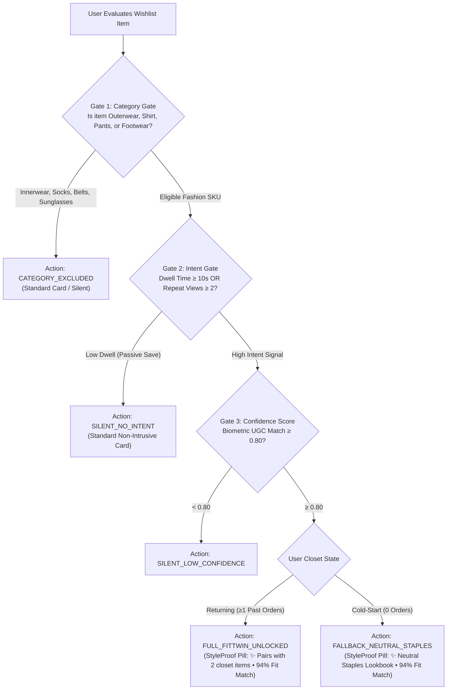
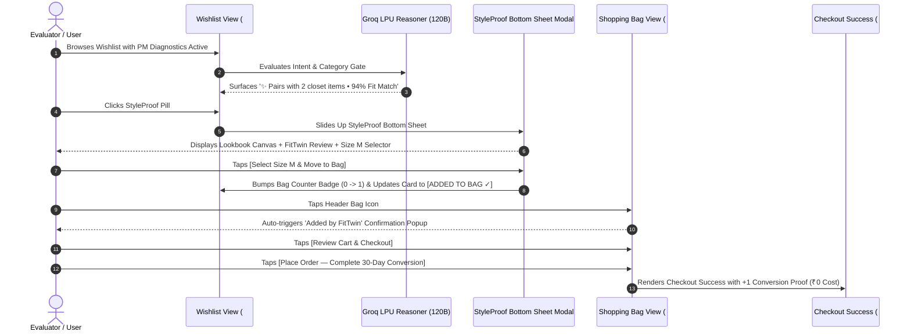

# 👗 MyntraStyleProof — Comprehensive Product & Prototype Specification

**Project:** NextLeap Product Management Graduation Project  
**Prototype Title:** MyntraStyleProof (Intent-Gated FitTwin & Wardrobe Lookbook Engine)  
**Live Production URL:** [https://myntra-style-proof.vercel.app](https://myntra-style-proof.vercel.app)  
**Source Repository:** `https://github.com/yalnizcurt/silce.git` (Refactored to `MyntraStyleProof`)  
**AI Reasoner:** Groq LPU Inference (`openai/gpt-oss-120b`)  

---

## 1. Product Thesis & Value Proposition

**Core Thesis:** *Fashion shoppers do not leave items in their wishlist because of price alone; they leave items because of unaddressed sizing anxiety and styling ambiguity.*

By delivering **deterministic outfit contextualization** (Pillar 1: Wardrobe Lookbook Canvas) and **biometric social proof** (Pillar 2: FitTwin UGC Reviews) at the exact moment of high purchase intent, Myntra can convert wishlists to orders organically without discount dependency.

---

## 2. Catalog Dataset (15 Authentic Diverse SKUs)

The catalog covers diverse tops, bottoms, outerwear, footwear, and excluded commodity items with realistic pricing, biometric reviews, and category gating tags:

```
┌─────────────────────────────────────────────────────────────┬───────────┬──────────────┬───────────────────────────────┐
│ SKU ID & Product Title                                      │ Price     │ Category     │ Gate Status & FitTwin Verdict │
├─────────────────────────────────────────────────────────────┼───────────┼──────────────┼───────────────────────────────┤
│ WISH_SKU_101: Roadster Men Brown Suede Biker Jacket         │ ₹2,499    │ Topwear      │ 🟢 ELIGIBLE (M • 94% Match)   │
│ WISH_SKU_102: Mast & Harbour Relaxed Camp Collar Linen Shirt│ ₹1,299    │ Topwear      │ 🟢 ELIGIBLE (M • 94% Match)   │
│ WISH_SKU_103: Kook N Keech Men Black Graphic Oversized Tee  │ ₹799      │ Topwear      │ 🟢 ELIGIBLE (M • 92% Match)   │
│ WISH_SKU_104: Highlander Solid Olive Slim Fit Cargo Trousers│ ₹1,499    │ Bottomwear   │ 🟢 ELIGIBLE (32 • 94% Match)  │
│ WISH_SKU_105: Wrogn Men Dark Indigo Slim Tapered Jeans      │ ₹1,999    │ Bottomwear   │ 🟢 ELIGIBLE (32 • 88% Match)  │
│ WISH_SKU_106: HRX Chunky Street Style Leather Sneakers      │ ₹1,899    │ Footwear     │ 🟢 ELIGIBLE (UK 8 • 94% Match)│
│ WISH_SKU_107: Red Tape Men Classic Tan Leather Chelsea Boots│ ₹2,799    │ Footwear     │ 🟢 ELIGIBLE (UK 9 • 94% Match)│
│ WISH_SKU_108: Damensch All-Day MicroModal Boxer Briefs      │ ₹899      │ Innerwear    │ 🔴 BLOCKED (Category Excluded)│
│ WISH_SKU_109: Nike Everyday Cushioned Cotton Ankle Socks    │ ₹599      │ Accessories  │ 🔴 BLOCKED (Category Excluded)│
│ WISH_SKU_110: Fastrack Polarized Round Geometric Sunglasses │ ₹1,199    │ Accessories  │ 🔴 BLOCKED (Category Excluded)│
│ WISH_SKU_111: Snitch Cuban Collar Textured Knit Polo        │ ₹1,399    │ Topwear      │ 🟢 ELIGIBLE (M • 92% Match)   │
│ WISH_SKU_112: Rare Rabbit Tailored Pleated Smart Chinos     │ ₹2,999    │ Bottomwear   │ 🟢 ELIGIBLE (32 • 94% Match)  │
│ WISH_SKU_113: H&M Men Relaxed Fit Denim Overshirt / Trucker │ ₹2,299    │ Topwear      │ 🟢 ELIGIBLE (M • 92% Match)   │
│ WISH_SKU_114: Woodland Men Camel Suede Low-Top Skate Shoes  │ ₹2,695    │ Footwear     │ 🟢 ELIGIBLE (UK 8 • 92% Match)│
│ WISH_SKU_115: Tommy Hilfiger Full-Grain Leather Belt        │ ₹1,499    │ Accessories  │ 🔴 BLOCKED (Category Excluded)│
└─────────────────────────────────────────────────────────────┴───────────┴──────────────┴───────────────────────────────┘
```

---

## 3. Strict 3-Tier Intent & Category Gating Engine (`engine/eligibility_gate.py`)

StyleProof does not spray badges indiscriminately. It activates **only when both product eligibility and high purchase intent are strictly matched**:



---

## 4. 3-Persona Test Harness (`data/user_personas.json`)

To enable rigorous PM grading, the prototype includes a sticky **Persona Switcher** in the top navigation:

| Persona Name | Segment & Biometrics | Closet Purchases | Gating & Styling Behavior |
| :--- | :--- | :--- | :--- |
| **Arjun Sharma** (`USER_ARJUN_01`) | **Returning Customer**<br/>`5'9" • 68kg` (Athletic)<br/>Benchmark: Zara M, Levi's 32 | **3 Orders** (Levi's 511s, HRX Sneakers, Olive Chinos) | **Full FitTwin Unlocked:** High dwell triggers Lookbook Canvas pairing with his owned jeans and sneakers + 5'9" Size M FitTwin quote. |
| **Rohan Verma** (`USER_ROHAN_02`) | **Cold-Start New User**<br/>`5'11" • 75kg` (Broad)<br/>Benchmark: Zara L, Levi's 34 | **0 Orders** (No purchase history) | **Adaptive Universal Staples:** High dwell triggers outfit pairing with universal neutral basics (Organic White Tee & Black Tapered Denim) + 5'11" Size L FitTwin quote. |
| **Priya Nair** (`USER_PRIYA_03`) | **Passive Moodboarder**<br/>`5'6" • 54kg` (Petite)<br/>Benchmark: Zara S, Levi's 28 | **1 Order** (Knit Cardigan) | **Non-Intrusive & Silent:** Low dwell (<5s) means all 15 cards remain standard Myntra cards with no pills until explicitly evaluated. |

---

## 5. The End-to-End Conversion Funnel



### Key Funnel UI Elements:
1. **Interactive StyleProof Modal**:
   * **Pillar 1:** Complete Lookbook Canvas displaying Wishlisted SKU + 2 owned closet items (or neutral staples).
   * **Pillar 2:** FitTwin Verified Customer Photo, exact height/weight quote, and Zara/H&M cross-brand calibration.
   * **Size Chips:** Visual chips with green **"FitTwin Pick"** dot.
2. **"Added by FitTwin" Confirmation Popup in Bag**:
   * ✔ **Fit Calibration:** Size M verified against 42 buyers with matching torso dimensions.
   * ✔ **Closet Pairing:** Styled with owned Levi's jeans and HRX sneakers (or universal basics).
   * ✔ **Non-Monetary Conversion:** Full-price purchase confidence without waiting for sales.
3. **Checkout Success Screen**:
   * Logs `Wishlist → Purchase Conversion = SUCCESS (+1)`.
   * Confirms `Cost to Platform = ₹0 (Non-Monetary Constraint Preserved)`.

---

## 6. PM Diagnostics Inspector Mode

* **Toggle Switch:** Sticky top bar switch labeled `🔬 PM Diagnostics`.
* **Live Card Chips:**
  * `[INTENT]`: Session Dwell time and repeat view count.
  * `[CATEGORY GATE]`: `ELIGIBLE` vs. `BLOCKED`.
  * `[CONFIDENCE]`: Real-time biometric match score (`0.88 - 0.94`).
  * `[SYSTEM ACTION]`: `FULL_FITTWIN_UNLOCKED`, `FALLBACK_NEUTRAL_STAPLES`, `SILENT_NO_INTENT`, or `CATEGORY_EXCLUDED`.

---

## 7. Local Execution & Cloud Deployment

### Local Execution:
```bash
cd /Users/srikarvuyyuru/MYNTRA/ENGINE/MyntraStyleProof
python3 -m venv venv
source venv/bin/activate
pip install -r requirements.txt
PORT=8080 python server.py
```
Open **`http://localhost:8080`** to test the interactive prototype.

### Live Production Deployment:
* **Vercel Production URL:** [https://myntra-style-proof.vercel.app](https://myntra-style-proof.vercel.app)
